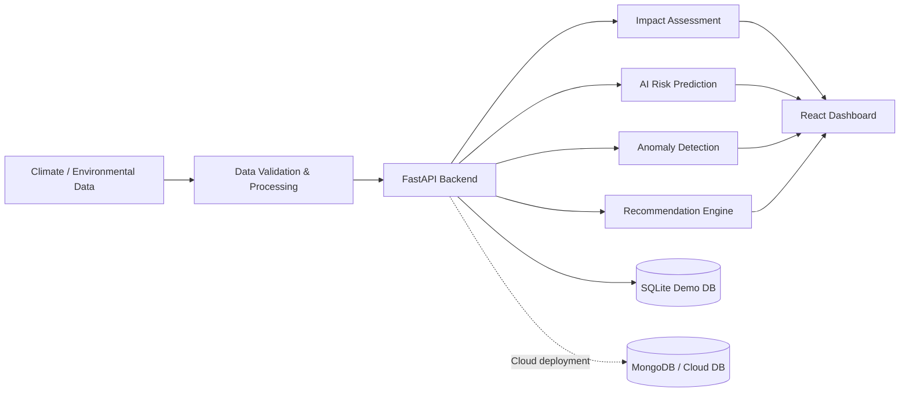

# Architecture

## Technology mapping
- Big Data: large historical dataset, tabular processing and scalable ingestion design.
- AI: Random Forest regression/classification and anomaly detection.
- Cybersecurity: authentication, hashing, JWT, validation, audit logs.
- Cloud Computing: Docker and MongoDB-ready configuration.
